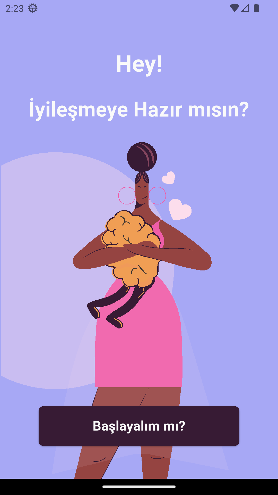
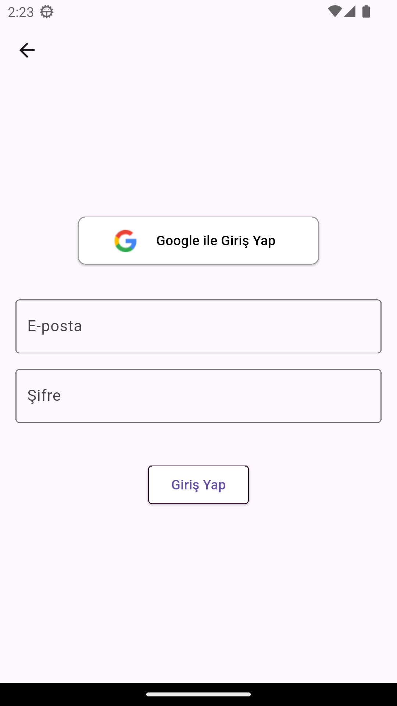
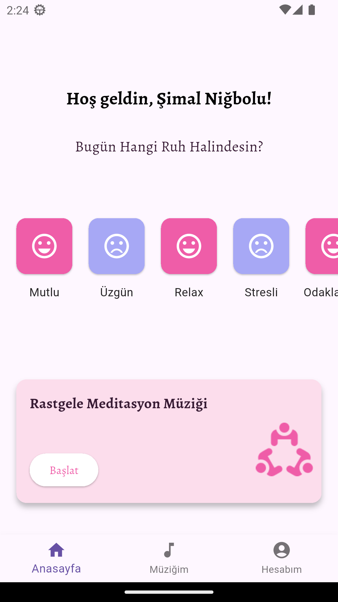
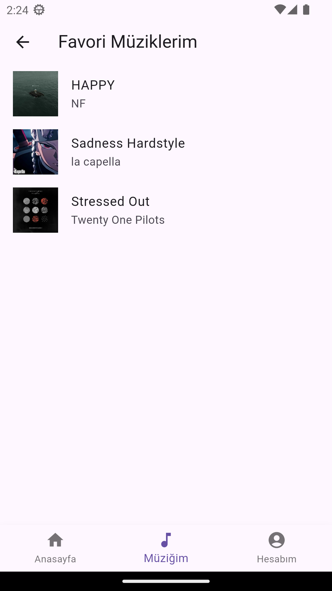
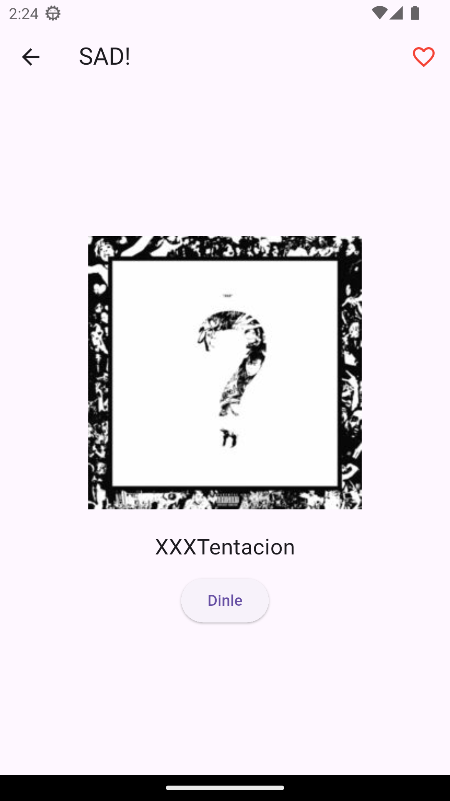
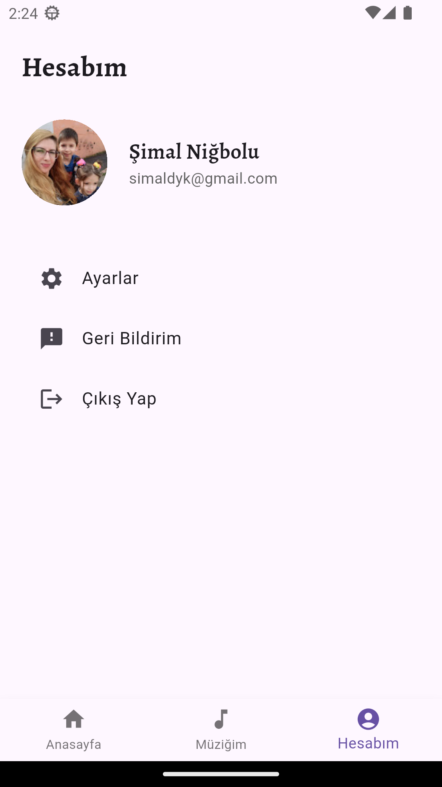
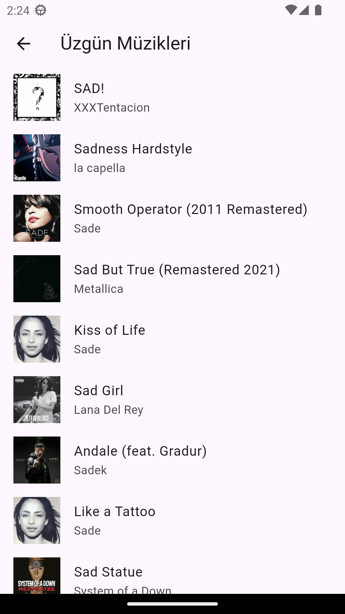
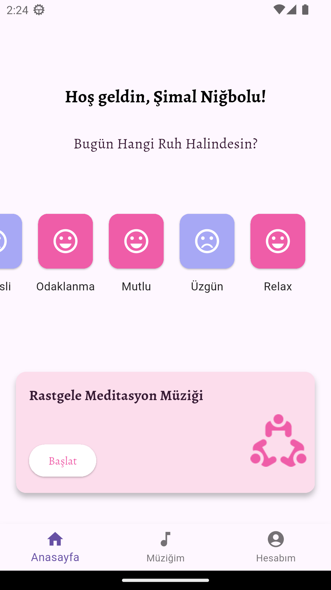

# Meditasyon App

Meditasyon App, farklı ruh halleri için özel müzikler sunan, kullanıcı dostu ve modern bir Flutter mobil uygulamasıdır.  
Kullanıcıların rahatlamasına, meditasyon yapmasına ve kendini iyi hissetmesine yardımcı olmak için tasarlanmıştır.

---

## Uygulama Özellikleri

- **Google ve Email/Şifre ile Güvenli Giriş:** Firebase kimlik doğrulama kullanılır.
- **Ruh Hali Bazlı Müzik Listeleri:** Kullanıcı ruh haline göre müzik kategorileri arasında kolayca gezinebilir.
- **Rastgele Müzik Çalar:** Kişisel müzik deneyimini artırmak için rastgele müzik seçme özelliği.
- **Favorilere Ekleme:** Sevilen müzikler favorilere eklenebilir, kolayca erişilebilir.
- **Basit ve Şık Tasarım:** Kullanıcı deneyimini ön planda tutan modern arayüz.

---

## Uygulama Ekranları

| Ana Sayfa | Favoriler | Kategori |
| --------- | --------- | -------- |

  |  

  

 

  

---

## Teknolojiler

- Flutter
- Firebase Authentication  (Email/Şifre ve Google ile Giriş)
- Deezer API
- just_audio Paketi
- GetX State Management

---

Meditasyon App, kullanıcıların ruh haline uygun müzikleri kolayca bulup dinleyebildiği, aynı zamanda güvenli ve basit bir deneyim sunduğu bir projedir. Gelişmeye devam etmektedir.

---

 HEAD
=======
For help getting started with Flutter development, view the
[online documentation](https://docs.flutter.dev/), which offers tutorials,
samples, guidance on mobile development, and a full API reference.
İlk yükleme ve README çakışması çözüldü
>>>>>>> 29b79fa (Update README and add screenshots)
